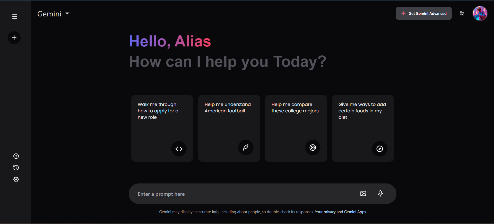
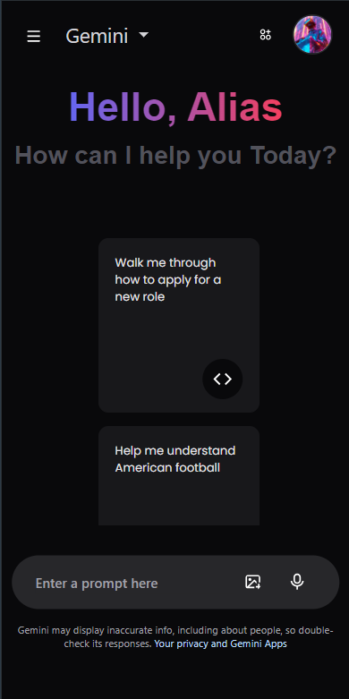

# 🌟 Gemini Website Clone

Welcome to my Gemini website clone project! This project is built using **React JS**, **JavaScript**, **Tailwind CSS**, and the **tailwind-animate plugin**. It’s designed to closely mimic the real Gemini website, providing a hands-on experience with modern web development technologies.


https://github.com/user-attachments/assets/d21fd47a-3780-4dff-838f-7ee6dcf65562


## 🚀 Features

- **Google Gemini API Integration**: Fetches and displays responses based on user input.
- **Responsive Design**: Optimized for desktop and mobile devices.
- **Loading Animations**: Sleek animations while data is being fetched.
- **Recent Prompts Sidebar**: Keeps track of recent prompts for quick access.
- **Component-Based Architecture**: Built using reusable React components.

## 🔧 Tech Stack

- **React JS**: Frontend framework for building the user interface.
- **JavaScript**: Programming language powering the application logic.
- **Tailwind CSS**: Utility-first CSS framework for styling.
- **Tailwind Animate Plugin**: Adds smooth animations to enhance UX.

## 🛠️ Setup & Installation

1. **Clone the repository:**
   ```bash
   git clone https://github.com/gudapepratik/Gemini-clone.git
   ```
2. **Navigate to the project directory:**
   ```bash
   cd Gemini-clone
   ```
3. **Install dependencies:**
   ```bash
   npm install
   ```
4. **Run the development server:**
   ```bash
   npm run dev
   ```
5. **Open the project in your browser:**
   Visit `http://localhost:5173`

## 🖼️ Screenshots

| Desktop View  | Mobile View  |
|:-------------:|:------------:|
|  |  |

## 🤔 Why Build a Clone?

Creating clones is a powerful way to deepen your understanding of web technologies. It allows you to:
- **Master React Concepts**: Practice Context API, state management, and component reusability.
- **Experiment with Real-World APIs**: Learn how to integrate and manage third-party APIs.
- **Enhance Design Skills and Gain confidence**: Get hands-on with responsive design and CSS frameworks.

## 📈 Roadmap

- [ ] Add authentication functionality.
- [ ] Improve loading animations for better UX.
- [ ] Expand feature set with additional API integrations.

🤝 Contributing
Contributions are welcome! If you have ideas to enhance this project, feel free to fork the repo and submit a pull request.
